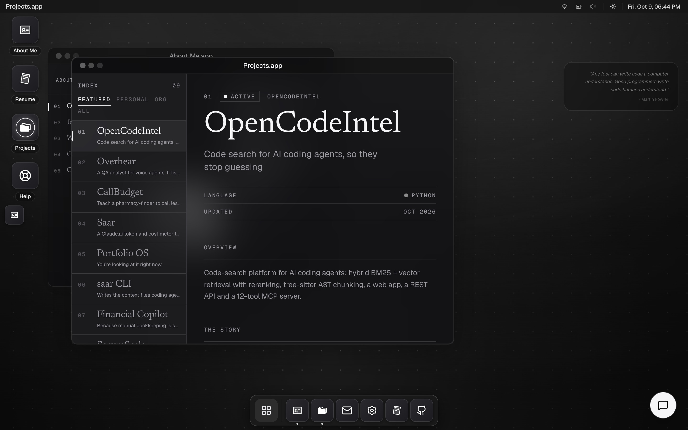
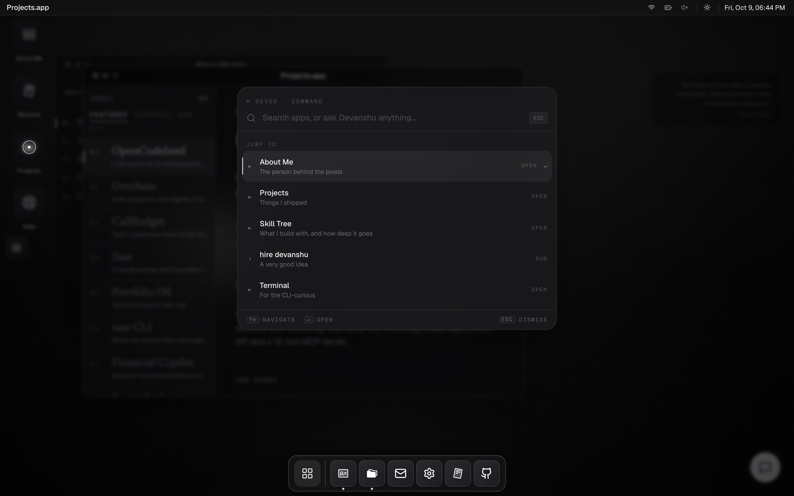
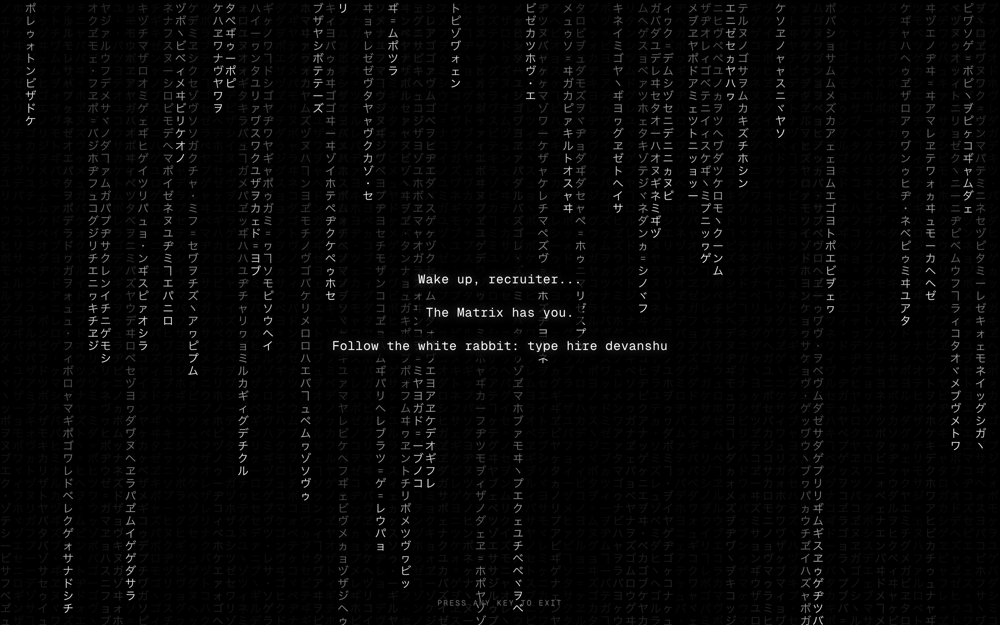
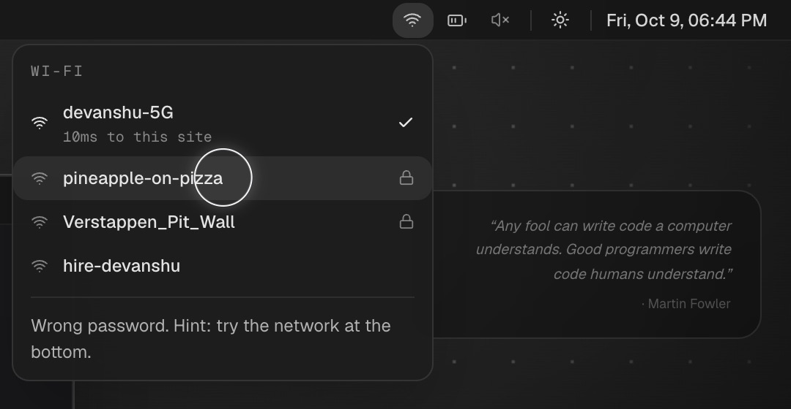
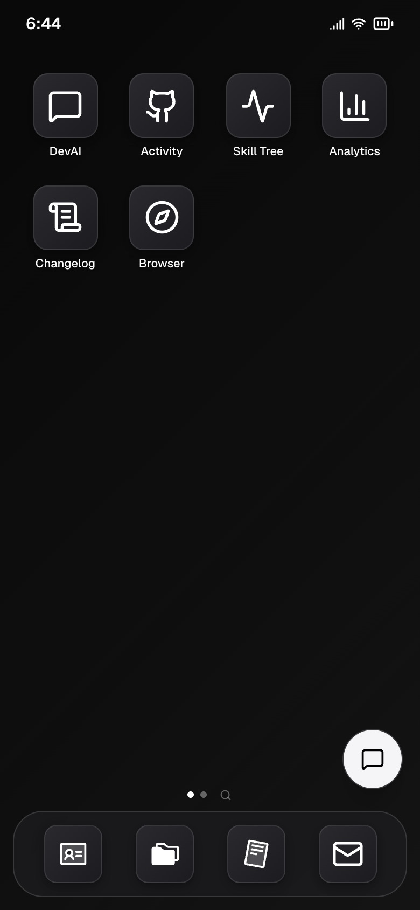

# Portfolio OS (devOS)

> A portfolio that boots. Windows, a dock, a real terminal, an AI that answers as me, and a phone version that is a whole second OS.

**[devanshuchicholikar.com](https://www.devanshuchicholikar.com)** · built by [Devanshu Chicholikar](https://github.com/DevanshuNEU), software engineer and AI engineer in Boston · devOS v2.2



## Try this in 60 seconds

1. Press <kbd>⌘</kbd> <kbd>K</kbd> (or <kbd>/</kbd>) and type anything. Apps, projects and skills come up, and anything else goes to the AI.
2. Open the Terminal and type `matrix`. Then type `opinions`. Then, if you mean it, `hire devanshu` (that one emails me).
3. Click the Wi-Fi icon in the menu bar. Try to join `pineapple-on-pizza`.
4. Click the battery. In Chrome it reads yours.
5. Open it on your phone. Same OS, rebuilt for touch: home screen, App Library, swipe to dismiss.

## What's inside

| App | What it does |
|---|---|
| **About Me** | Who I am, how I got here, and the opinions I'll argue about |
| **Projects** | What I shipped, with the numbers and the caveats |
| **Resume** | The formal version, plus the PDF |
| **Terminal** | Autosuggest, tab completion, clickable output. `help` lists everything |
| **DevAI** | Chat with an AI that answers as me, grounded only in what this site says |
| **Finder** | The same projects as files and folders |
| **Skill Tree** | What I build with, and how deep it goes |
| **Activity** | Live commits and contributions from GitHub |
| **Browser** | My work, live on the open web |
| **Analytics** | What you did here. Transparent, I promise |
| **Ping Me** | A contact form that actually sends email |
| **Arcade** | Snake and Tetris, with touch controls on mobile |
| **Preferences** | Light or dark, mono or color, accent, wallpaper, sound |
| **Changelog** | What changed and when |
| **Help** | A guided tour, different on desktop and phone |

<table>
  <tr>
    <td width="50%"></td>
    <td width="50%"></td>
  </tr>
  <tr>
    <td></td>
    <td align="center"></td>
  </tr>
</table>

## How it works

- **One registry per platform.** Every app is a literal in `shared/types.ts`, an entry in `lib/appRegistry.ts` (desktop: size, position, dock) and one in `lib/mobileAppRegistry.ts` (home screen). The window manager, dock, Launchpad and Spotlight all read from them, so a new app is three registry entries and a component.
- **Two shells, one codebase.** Under 768px the desktop is swapped for `PhoneShell`, an iOS-style OS with its own navigation. Apps are shared and render a `variant="mobile"` layout.
- **The AI only knows what the site knows.** `/api/concierge` streams Claude, and the system prompt is built from the same data files the pages render (`aboutMe`, `resume`, `projectMeta`), so it can't invent a project. Replies are capped per visitor and per day, and em dashes are stripped server-side because I have opinions.
- **Projects are GitHub plus notes.** `/api/github/repos` pulls my public repos and enriches them from `data/projectMeta.ts` (story, metrics, featured order). If GitHub is down, the app falls back to the notes alone.
- **Every window has a plain-HTML twin.** The desktop is client-rendered, so `/about`, `/projects`, `/projects/[slug]` and `/resume` render the same data files as static HTML for search engines and AI crawlers. Each gets a generated 1200x630 preview card, and `robots.txt`, `sitemap.xml` and `llms.txt` are built from the same data.
- **The boot plays once per visit.** The first load gets the full sequence. A refresh in the same tab goes straight back to the desktop with your windows where you left them.
- **Shortcuts the browser can't steal.** Chrome keeps <kbd>⌘</kbd><kbd>T</kbd>, <kbd>⌘</kbd><kbd>W</kbd> and <kbd>⌘</kbd><kbd>1</kbd>-<kbd>4</kbd>, so devOS uses <kbd>⌥</kbd><kbd>T</kbd> (tour), <kbd>⌥</kbd><kbd>W</kbd> (close window) and <kbd>⌥</kbd><kbd>1</kbd>-<kbd>4</kbd> (open apps), matched on the physical key.

## Stack

Next.js 15 (App Router) · React 19 · TypeScript · Tailwind CSS · Framer Motion · Zustand · Anthropic SDK · Resend · PostHog · Upstash (optional) · Vitest and Testing Library · deployed on Vercel.

## Run it locally

```bash
cd frontend
npm install
cp .env.example .env.local   # every key is optional; see below
npm run dev                  # http://localhost:3000
```

```bash
npm test         # 560+ Vitest tests
npm run build    # production build
```

| Variable | What it turns on | Without it |
|---|---|---|
| `ANTHROPIC_API_KEY` | DevAI and the ask-anything row in the palette | The AI shows an offline note |
| `CONCIERGE_MODEL` | A different Claude model | `claude-sonnet-4-6` |
| `UPSTASH_REDIS_REST_URL`, `UPSTASH_REDIS_REST_TOKEN` | Rate limits that survive cold starts | An in-memory limiter, same caps |
| `GITHUB_TOKEN` | Higher GitHub API limits for Projects and Activity | Unauthenticated calls, then the notes-only fallback |
| `RESEND_API_KEY` | Contact form and `hire devanshu` emails | Those two don't send |
| `NEXT_PUBLIC_POSTHOG_KEY`, `NEXT_PUBLIC_POSTHOG_HOST` | Product analytics | No analytics |

## Layout

```
web-v2/
├── frontend/
│   └── src/
│       ├── app/              # layout, page, API routes (concierge, contact, github, notify-hire)
│       ├── components/
│       │   ├── os/           # desktop shell: window manager, dock, menu bar, Spotlight
│       │   ├── mobile/       # phone shell: home screen, App Library, lock screen
│       │   ├── apps/         # one file per app
│       │   └── effects/      # the matrix
│       ├── data/             # every word a visitor reads: about, projects, resume, skills, copy
│       ├── lib/              # registries, terminal commands, concierge prompt, shortcuts
│       ├── store/            # Zustand stores (windows persist across reloads)
│       └── __tests__/
└── shared/types.ts           # the AppType union both registries agree on
```

## Why an OS

I saw PostHog's OS-style website and couldn't unsee it. A portfolio is the one project where nobody can tell me to cut the fun parts, so I didn't.

If you're hiring: the projects in here are the real argument. Start with [OpenCodeIntel](https://github.com/OpenCodeIntel/opencodeintel) and [Overhear](https://github.com/DevanshuNEU/overhear), or just type `hire devanshu`.
